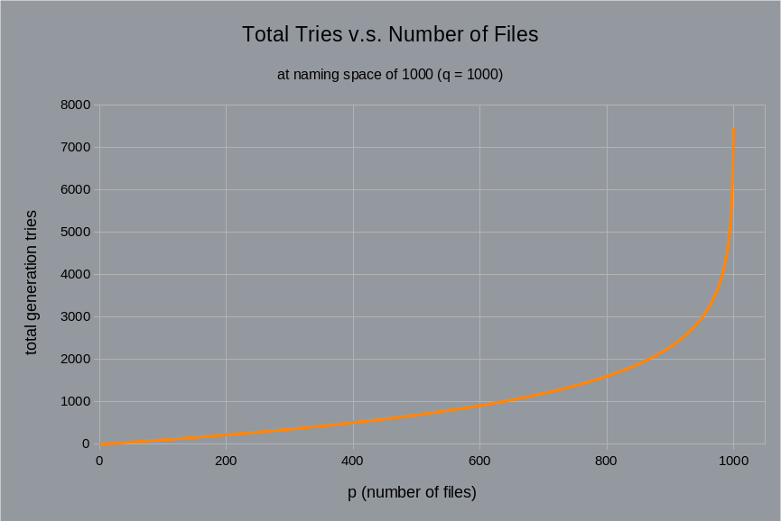

# Todo List

## Find an optimal value for `STRATEGY_RATIO_THRESHOLD`

When generating random names, if the number of files is on the same order of magnitude as the naming space, there will almost certainly be a lot of name collisions if we generate them individually (using `generate_on_demand` strategy), causing lots of retries.

Given `p` files and naming space size `q` (`p <= q`), the expected value of number of tries can be calculated as follows:

```rust
// partial sum of expected number of tries for each file
Exp(total_tries) = Sum(f = 0; f < p; f += 1){ Exp(tries[f]) }
```
where:
```rust
// infinite sum of (i * probability of success at i tries)
Exp(tries[f]) = Sum(i = 1; i -> Inf; i += 1){ i * P(success_at_try[i]) }
```
where:
```rust
// probability of colliding (i - 1) times * probability of not colliding
P(success_at_try[i]) = (f / q)^(i - 1) * (q - f) / q
```

Substituting and simplifying:

```rust
Exp(tries[f]) = Sum(i = 1; i -> Inf; i += 1){ i * (f / q)^(i - 1) * (q - f) / q }
  = Sum(i = 1; i -> Inf; i += 1){ i * (f / q)^i * (q - f) / f }
  = (q - f) / f * Sum(i = 1; i -> Inf; i += 1){ i * (f / q)^i }
  = (q - f) / f * (f * q / (q - f)^2)
  = q / (q - f)
```
```rust
Exp(total_tries) = Sum(f = 0; f < p; f += 1){ q / (q - f) }
```

If you select a concrete value for `q`, and plot `Exp(total_tries)` against `p`, you should be able to see that the expected number of tries starts out linear, but starts to increase hyperbolically as `p` approaches `q` due to the very high likelihood of collision.

For example:
 - [when `q = 1000` and `p = 950`](https://www.wolframalpha.com/input?i=sum+from+f%3D0+to+949%2C+1000%2F%281000-f%29), `Exp(total_tries) ≈ 2986`.
 - [when `q = 1000` and `p = 1000`](https://www.wolframalpha.com/input?i=sum+from+f%3D0+to+999%2C+1000%2F%281000-f%29), `Exp(total_tries) ≈ 7485`.



This is why rng-rename has an alternate strategy - `generate_then_match`. In this mode, we first generate all possible permutations given the charset, then randomly match them to files.

This is mode is non-economical when the number of possible permutations (naming space) is very large compared to the number of files, but it is increasingly appealing as the `generate_on_demand` strategy starts to cause an excessive amount of collisions, as the number of files approach the size of the naming space.

Therefore we use a hard-coded constant `STRATEGY_RATIO_THRESHOLD` to determine at which point we should switch from `generate_on_demand` to `generate_then_match`. This constant is located at `crate::compute::STRATEGY_RATIO_THRESHOLD`.

However, the optimal value for this constant is not trivially findable. Due to the difference in implementation of the two strategies, we cannot assume that a lower number of names generated (or its expected value) equates to overall better performance. Most likely, benchmarking is necessary to optimise the specific value of `STRATEGY_RATIO_THRESHOLD`.

If you would like to help with this task, you can force the strategy using the option `--force-generation-strategy`, then use a tool like `hyperfine` to measure the overall execution time.

## Refactor desired but blocked

 - `crate::compute::get_extension`
   - Awaiting implementation and stabilisation of `Path::file_suffix`
   - See https://github.com/rust-lang/rust/issues/86319#issuecomment-996152668
