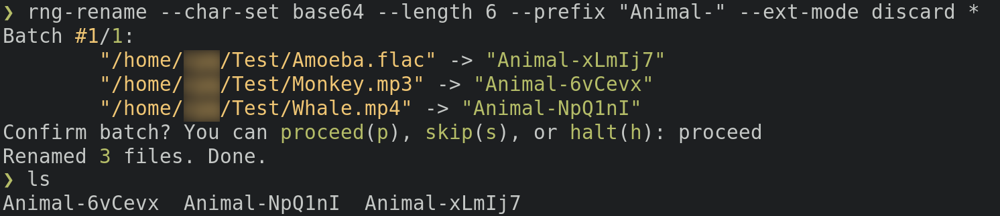

# rng-rename
A CLI tool to rename files to randomly generated strings.

## Why?
Suppose you downloaded a few hundred images to use as your desktop wallpapers. You have a
wallpaper tool that cycles through them, but unfortunately it only supports filename-ordering,
whereas you prefer to have the images shuffled.

Well, rng-rename to the rescue! Simply run this tool on all your images and the filename-ordering
is completely scrambled.

You can also use this tool for data analysis purposes. A data scientist might want to randomise
their dataset before running some analysis, but keep the same ordering over several runs.
rng-rename is useful in this case too.

I guess you can say rng-rename is a tool looking for a purpose. Ultimately it is up to you, the
user, to give it a one.

## Quick Start
```sh
# rename `path/to/foo` and `path/to/bar.txt` to randomly generated names
rng-rename path/to/foo path/to/bar.txt
```

You can expect something like this:
```
Batch #1/1:
        "/abs/path/to/foo" -> "09c43d3d"
        "/abs/path/to/bar.txt" -> "67aec57d.txt"
Confirm batch? You can proceed(p), skip(s), or halt(h): proceed
Renamed 2 files. Done.
```

Markdown doesn't show colours, but the real thing does!



There are plenty of various options available. You can for example:
 - Preview using the `--dry-run` flag
 - Choose which character set to use for random names using the `--char-set` option
 - Specify the number of random characters using the `--length` option
 - Choose upper/lower/mixed case where applicable using the `--case` option
 - Set a prefix and/or a suffix to the randomly generated name using `--prefix` and `--suffix` options
 - Choose what to do with the file extension using the `--ext-mode` option

And more. For full usage, run:
```sh
rng-rename --help
```
## Install

### from crates.io
[rng-rename on crates.io](https://crates.io/crates/rng-rename)

```sh
cargo install rng-rename
```

### from AUR
[rng-rename on AUR](https://aur.archlinux.org/packages/rng-rename)

```sh
# with paru
paru rng-rename

# or with yay
yay rng-rename
```
